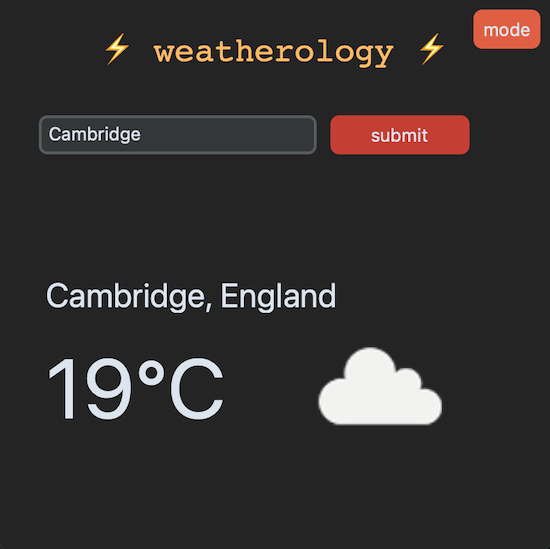
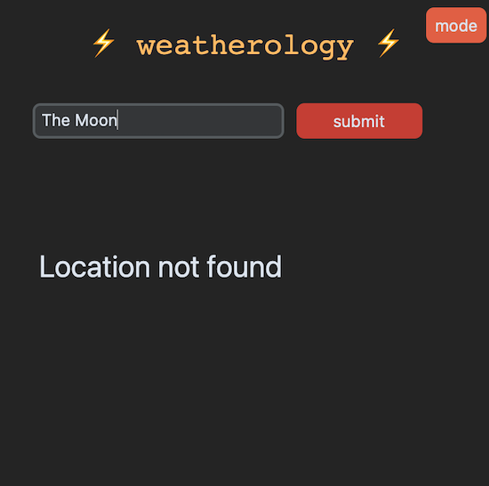

A simple UK weather app. GUI created using **CustomTkinter**.
### Features:
- dark/light mode

### Future development ideas:
- Handling of non-unique location names
- Ability to toggle between two tabs showing (tab 1) forecast for next 5 days (tab 2) breakdown by time interval of current day's forecast

### Screenshots of the app

